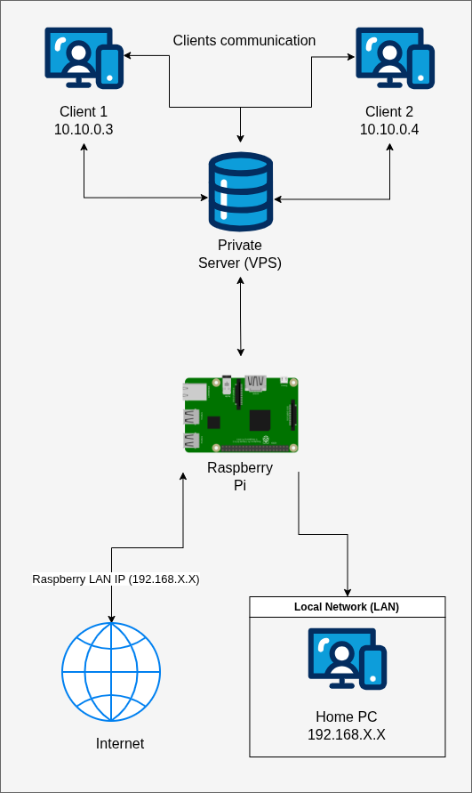

# VPN - Secure Remote Access Infrastructure

**Languages:** [Portuguese](README.md) | [English](README.en.md)

---

## Overview

This project implements a **Peer-to-Peer** secure remote access infrastructure using **WireGuard**, designed to work even in environments with **CGNAT (Carrier-Grade NAT)**.

The solution uses a **VPS with a public IP** as an intermediary to allow external clients to access devices within a private local network.

---

## Objectives

* Enable secure remote access to a local network
* Bypass CGNAT limitations
* Implement a simple, efficient, and scalable architecture
* Demonstrate advanced networking and security concepts

---

## Architecture

The infrastructure consists of three main components:

* **VPS (Public Server)** → central connection point
* **Raspberry Pi (LAN Gateway)** → access to the local network
* **Clients (Notebook/Desktop)** → remote access

---

## Network Topology



---

## Packet Flow (Summary)

1. Client sends a request to the local network (e.g., 192.168.0.X)
2. Traffic is encapsulated via WireGuard to the VPS
3. VPS forwards the traffic to the Raspberry Pi
4. Raspberry performs NAT and sends it to the LAN
5. The response returns through the same path

---

## Technologies Used

* WireGuard
* Linux Networking (iproute2, iptables)
* VPS (Oracle Cloud)
* SSH
* NAT / Routing

---

## Documentation

For full details, see:

* [VPN architecture](Docs/architecture.md)
* [Setup VPS](Docs/setup_vps.md)
* [Setup Raspberry](Docs/setup_raspberry.md)
* [Setup Clients](Docs/setup_clients.md)

---

## Quick Setup

### 1. Clone the repository

```bash
git clone https://github.com/ArtOliv/WireGuard-VPN.git
cd WireGuard-VPN
```

### 2. Install WireGuard

Install WireGuard on each node if it is not already installed:


```bash
sudo apt install wireguard
```

### 3. Configure the VPS

After connecting to the VPS via SSH and cloning the repository, run:


```bash
cd scripts
chmod +x setup-vps.sh
./setup-vps.sh
```

### 4. Configure the Raspberry Pi

After cloning the repository on the Raspberry Pi, run:

```bash
cd scripts
chmod +x setup-raspberry.sh
./setup-raspberry.sh
```

### 5. Configure the Client

After cloning the repository on the Notebook/Desktop, run:

```bash
cd scripts
chmod +x setup-client.sh
./setup-client.sh
```

---

## Testing

Connectivity test:

```bash
ping 10.10.0.2
```

LAN access test:

```bash
curl http://192.168.X.X
```

---

## Security Considerations

* Private keys **are not stored in the repository**
* Encrypted communication using WireGuard
* SSH with key-based authentication
* Firewall rules applied across nodes

---

## Initial Challenges

* CGNAT blocks incoming connections
* Need for PersistentKeepalive
* Correct forwarding configuration between peers
* VPS firewall may block UDP traffic

---

## Lessons Learned

* WireGuard is stateless (depends on traffic for handshake)
* NAT traversal requires keepalive
* Network debugging requires tools like tcpdump
* Routing and firewall configuration are critical for proper operation

---

## Author

`Arthur Carvalho Rodrigues Oliveira`

Project developed for personal use and study in cybersecurity and networking.

---

## License

This project is licensed under the MIT License.